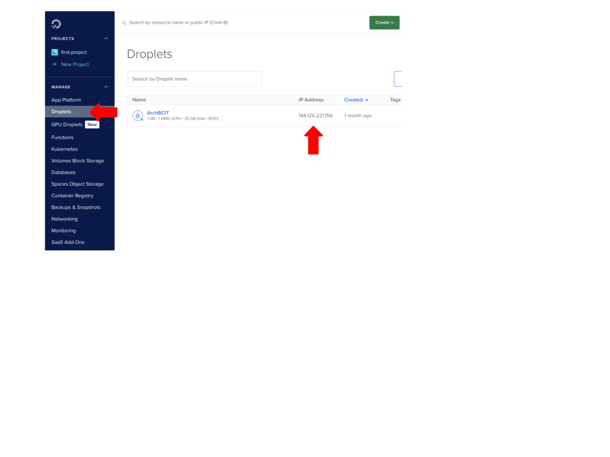
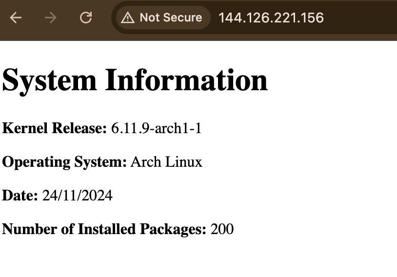

# Assignment 3 - Part 1


The goal of this assignment is to create a Bash script that generates a static `index.html` file that contains system information, the file runs daily at 05:00 using a `systemd` service and timer. The script that creates the HTML document will be ran on your Arch Linux and hosted from a `nginx` web server which has a `ufw` (uncomplicated firewall) to secure your server. 

note to self:
make sure the questions are answered

## Table of Contents


## Task 1: Creation of System User 

1. Creating a new system user 

Copy the following command to create a system user 

```
sudo useradd -r -d /var/lib/webgen -s /usr/sbin/nologin webgen
```

-*r*: creates a system account 

-*d*: specifies the home directory

-*s*: specifes a non login shell 

2. Copy and paste the following command to create a home directory. 

```
sudo mkdir -p /var/lib/webgen
```

Then, copy and paste the following command to create `bin` and `HTML` sub-directories in the webgen directory.

```
sudo mkdir -p /var/lib/webgen/bin /var/lib/webgen/HTML
```

3. Git clone repository. 

Copy and Paste the command below to gain the generate_index starter file. 

```
git clone https://git.sr.ht/~nathan_climbs/2420-as2-start

```
>[!NOTE]
Make sure to use `ls` command to verify if the repository is cloned. Look for `2420-as2-start/`. 

4. Moving generate_index file to `/var/lib/webgen/bin` directory. 

```
sudo mv 2420-as2-start/generate_index /var/lib/webgen/bin/
```
>[!NOTE]
You must give `generate_index` permission to be executable. 

Copy and Paste the command to give it permission. 

``` 
sudo chmod +x /var/lib/webgen/bin/generate_index
```

5. Create the `index.html` file. 

Type the following command to `cd` into the `/webgen/HTML` directory. 

```
cd /var/lib/webgen/HTML/
```

Then run

```
sudo nvim index.html
```
>[!NOTE]
To see the directory structure, install tree by copying the following command

``` 
sudo pacman -S tree
```
then

```
tree /var/lib/webgen
```
This will show the structure of the new systems user home directory.

6. Setting ownership to webgen.

```
sudo chown -R webgen:webgen /var/lib/webgen
```

## Task 2: Creation of service and timer scripts

1. Creation of `generate-index.service` file.

Type the following command to create the service file

```
sudo nvim /etc/systemd/system/generate-index.service
```

Copy the following into `generate-index.service` 

``` ini
[Unit]
Description=Generate Index HTML

[Service]
User=webgen
Group=webgen
ExecStart=/var/lib/webgen/bin/generate_index
```

2. Creating the `generate-index.timer` file

Type the command 

```
sudo nvim /etc/systemd/system/generate-index.timer
```
Copy the following into `generate-index.service`

``` ini
[Unit]
Description=Runs generate-index.service everyday at 05:00

[Timer]
OnCalendar=*-*-* 05:00:00
Persistent=true

[Install]
WantedBy=timers.target
```

3. Starting the service 

To start the service, type the following command 

```
sudo systemctl start generate-index.service 
```
To see the status of the service, type the command below

```
sudo systemctl status generate-index.service 
```
>[!NOTE]
The service status will say inactive but enabled. 

Type the following command below to view the logs of the service

```
sudo journalctl -u generate-index.service
```

4. Enabling and Starting the timer

Type the following command to enable the timer

```
sudo systemctl enable generate-index.timer
```

Then, type the command below to start the timer 

```
sudo systemctl start generate-index.timer
```

Check the status of the timer by typing the command

```
sudo systemctl status generate-index.timer 
```

## Task 3: Configuration of nginx and creation of Server Blocks 

1. Install nginx by copying and pasting the command below

```
sudo pacman -S nginx
```

2. Editing the `nginx.conf` file

Type the following command to edit the `nginx.conf` file

```
sudo nvim /etc/nginx/nginx.conf
```

3. Editing user in nginx and http

Change `#user http;` to `webgen` `webgen` 

```
user webgen webgen;
```
Add sites-enabled into your `http` block above `server`

```
include /etc/nginx/sites-enabled/*;
```

4. Create `sites-available` and `sites-enabled` directory

Run the following command to create the directories

```
mkdir /etc/nginx/sites-available
```
and 

```
mkdir /etc/nginx/sites-enabled
```

5. Creation of server block in `sites-available`

Type the following command to create a new server block file

```
sudo nvim /etc/nginx/sites-available/webgen
```

Copy and Paste the following in the server block

```
server {
    listen 80;
    server_name localhost.webgen;

    root /var/lib/webgen/HTML;
    index index.html;

    location / {
        try_files $uri $uri/ =404;
    }
}
```

6. Enabling the server block using a symlink

Type the following command to symlink the server block

```
sudo ln -s /etc/nginx/sites-available/webgen /etc/nginx/sites-enabled/ 
```
7. Testing Nginx

Type the command below to test nginx 

```
sudo nginx -t
```

>[!NOTE]
You should see a text output like
nginx: 
the configuration file /etc/nginx/nginx.conf syntax is ok
nginx: configuration file /etc/nginx/nginx.conf test is successful

8. Restarting Nginx

To restart nginx, run the following command

```
sudo systemctl restart nginx
```

9. Starting Nginx

Copy and Paste the command to start nginx

```
sudo systemctl start nginx
```

>[!IMPORTANT]
To see if nginx is active and running, run the following command. 

```
sudo systemctl status nginx
``` 

## Task 4: Configuration of UFW (SSH and UFW)

1. Install UFW

Run the following command to insall UFW

```
sudo pacman -S ufw
```
>[!CAUTION]
Do NOT enable UFW after installing, if done, you will be locked out of your droplet. 

2. Allowing SSH and HTTP

To allow SSH and HTTP, run the following command

```
sudo ufw allow ssh
```
and

```
sudo ufw allow http
```
>[!Note]
You may run into a error due to `iptables` 

To fix this issue

1. Run `sudo pacman -Syu`
2. Turn off droplet using the digital ocean

or

1. Run `sudo pacman -S iptables` to update the `iptables` version
2. Then, `sudo systemctl restart iptables` to restart `iptables`

>[!Important]
Make sure after running step 2 commands it says.
Rule updated
Rule updated (v6)

3. SSH rate limiting 

To limit the SSH rate, type the following command 

```
sudo ufw limit ssh
```

4. Enabling UFW

Type the following command to enable UFW.

```
sudo ufw enable
```

>[!Important]
Make sure to check the status of your firewall.

5. Status of UFW

To see the status of UFW, run the command below.

```
sudo ufw status
```
You shold see results like below

```
Status: active

To                         Action      From
--                         ------      ----
22                         ALLOW       Anywhere                  
80                         ALLOW       Anywhere                  
22 (v6)                    ALLOW       Anywhere (v6)             
80 (v6)                    ALLOW       Anywhere (v6)  
```

## Task 5: System Information Page 

1. Droplet IP Adress

To find your droplet's IP adress, log into DigitalOcean and click the droplet section, then find your droplet and you will see your ip address. 


2. Visiting the system information web server page.

Go to your perferred browser and type.

```
http://droplet-ip
```
Your page should be like this



You have successfully completed the tasks!

## References


